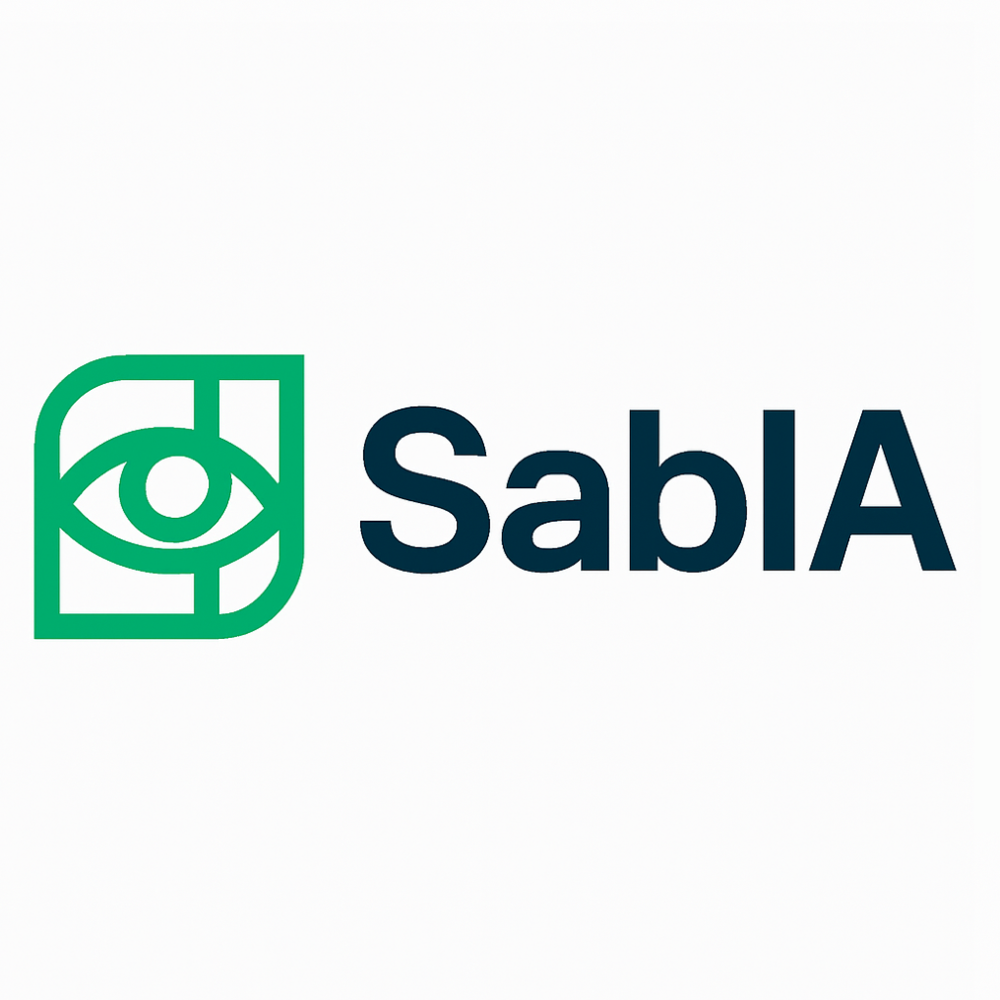

  

## SabIA Labs

SabIA Labs é um laboratório brasileiro focado em plataformas de visão computacional compatíveis com o SDK da AWS (Rekognition e Textract). Nosso objetivo é oferecer uma alternativa com baixa latência, residência de dados no Brasil e uma experiência de desenvolvedor familiar.

### O que oferecemos

- **Compatibilidade com AWS SDK**: mantenha seu código, troque apenas o endpoint
- **Infra no Brasil**: menor latência e residência de dados local
- **Onboarding rápido**: sandbox para testes e métricas em tempo real
- **Preços previsíveis**: cobrança por request e limites configuráveis

### APIs e recursos

- Reconhecimento facial: detecção/análise de faces, comparação, busca por coleções
- OCR em imagens: detecção de texto em fotos (placas, embalagens, etc.)
- OCR de documentos (Textract-compat): `DetectDocumentText` via cliente Textract
- Observabilidade: métricas por chave, logs mascarados, webhooks de limites

### Status e roadmap

Este repositório `.github` reúne materiais institucionais (logo, perfil, guias) e centraliza informações públicas. Nosso roadmap inclui:

- Documentação pública detalhada
- Exemplos de uso com AWS SDK v3 (Node.js, Python)
- Guias de migração e melhores práticas

Contribuições e feedback são bem-vindos.

### Como contribuir

1. Abra uma issue com sua sugestão ou problema encontrado
2. Descreva claramente o contexto e o impacto
3. Siga discussões existentes antes de criar itens duplicados

Para contribuições de código em repositórios de produto, consulte os READMEs específicos de cada projeto.

### Links

- Website: `https://sabia-labs.github.com`
- Identidade visual: pasta `assets/`
- Repositórios públicos: acesse nosso perfil no GitHub

### Contato

- Email: `sabia.labs@gmail.com`

—
SabIA Labs • Visão computacional no Brasil
